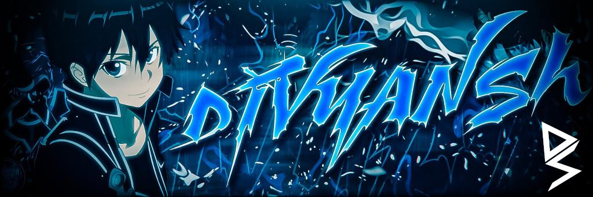

    

##  About Me
<!-- &nbsp; -->
Hi 👋, I'm Divyansh Sood, a developer committed to building practical, well-structured solutions with a focus on backend development and system efficiency. I manage creator communities, work closely with content teams, and enjoy turning ideas into functional products that actually solve problems. I’m continuously improving my skills in Python, Java, and general software design, while staying involved in leadership and project management. Open to collaborations, technical contributions, or any opportunity where solid execution matters more than fluff.

&nbsp;
    
    
    
    

    

    

